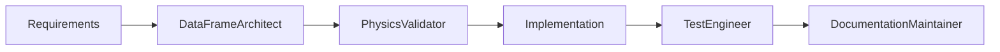
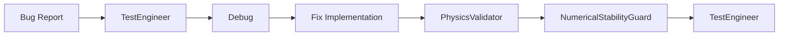
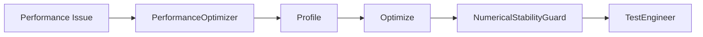
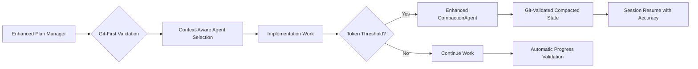

# SolarWindPy Agents Index

## Overview
This index provides a centralized reference for all specialized agents working on the SolarWindPy codebase. Each agent has specific responsibilities and expertise areas.

## Agent Categories

### 🎯 Planning & Implementation (Enhanced with Git-First Validation)
- **[PlanManager](./agent-plan-manager.md)** - Strategic planning optimized for token efficiency
- **[PlanManager-Full](./agent-plan-manager-full.md)** - Enhanced strategic planning with git-first validation and context-aware agent pairing
- **[PlanManager-Minimal](./agent-plan-manager-minimal.md)** - Basic planning for simple projects and prototypes
- **[PlanImplementer](./agent-plan-implementer.md)** - Plan execution with QA integration (Research optimized)
- **[PlanImplementer-Full](./agent-plan-implementer-full.md)** - Complete enterprise implementation agent
- **[PlanImplementer-Minimal](./agent-plan-implementer-minimal.md)** - Basic plan execution for simple tasks
- **[CompactionAgent](./agent-compaction.md)** - Enhanced universal context compression with session state validation

### 🔬 Core Physics & Data
- **[PhysicsValidator](./agent-physics-validator.md)** - Ensures physical correctness and unit consistency
- **[DataFrameArchitect](./agent-dataframe-architect.md)** - Manages pandas MultiIndex data structures
- **[NumericalStabilityGuard](./agent-numerical-stability-guard.md)** - Prevents numerical errors

### 🧪 Testing & Quality
- **[TestEngineer](./agent-test-engineer.md)** - Maintains comprehensive test coverage
- **[PerformanceOptimizer](./agent-performance-optimizer.md)** - Optimizes computational performance

### 📊 Analysis & Visualization
- **[FitFunctionSpecialist](./agent-fit-function-specialist.md)** - Manages curve fitting and optimization
- **[PlottingEngineer](./agent-plotting-engineer.md)** - Creates publication-quality visualizations

### 📚 Documentation & Dependencies
- **[DocumentationMaintainer](./agent-documentation-maintainer.md)** - Maintains comprehensive documentation
- **[DependencyManager](./agent-dependency-manager.md)** - Manages package dependencies

## Quick Reference

| Agent | Priority | Primary Focus | Key Files |
|-------|----------|--------------|-----------|
| PlanManager | High | Strategic planning (token optimized) | `solarwindpy/plans/*.md`, plan branches |
| PlanManager-Full | High | Strategic planning (comprehensive) | `solarwindpy/plans/*.md`, plan branches |
| PlanManager-Minimal | Medium | Basic planning (lightweight) | `solarwindpy/plans/*.md`, plan branches |
| PlanImplementer | High | Plan execution | All implementation files |
| CompactionAgent | Medium | Context compression & session continuity | `solarwindpy/plans/*/compacted_state.md` |
| PhysicsValidator | High | Physical correctness | `core/*.py`, `instabilities/*.py` |
| DataFrameArchitect | High | Data structures | `core/*.py` |
| TestEngineer | High | Testing | `tests/**/*.py` |
| NumericalStabilityGuard | High | Numerical stability | `fitfunctions/*.py`, `instabilities/*.py` |
| FitFunctionSpecialist | Medium | Curve fitting | `fitfunctions/**/*.py` |
| PlottingEngineer | Medium | Visualization | `plotting/**/*.py` |
| PerformanceOptimizer | Medium | Performance | `core/*.py`, `tools/*.py` |
| DocumentationMaintainer | Medium | Documentation | `docs/**`, `*.py` |
| DependencyManager | Low | Dependencies | `requirements*.txt`, `pyproject.toml` |

## Agent Coordination Workflows

### New Feature Development

### Bug Fix Process

### Performance Optimization

### Unified Development Workflow (Enhanced)

### Session Continuity Architecture
- **Single Point of Entry**: Enhanced Plan Manager handles all planning functions
- **Git-First Validation**: Automatic session state accuracy checking
- **Context Switching Prevention**: Infrastructure priority framework built-in
- **Unified Progress Tracking**: Git-validated status without competing systems

## Agent Communication Protocol

### Priority Levels
1. **Always/High Priority**: Must be consulted for any changes
   - PhysicsValidator (physics changes)
   - DataFrameArchitect (data structure changes)
   - TestEngineer (all code changes)

2. **Medium Priority**: Consulted for specific domains
   - FitFunctionSpecialist (fitting algorithms)
   - PlottingEngineer (visualization)
   - PerformanceOptimizer (performance issues)

3. **Low Priority**: Periodic maintenance
   - DocumentationMaintainer (documentation updates)
   - DependencyManager (dependency updates)

### CompactionAgent Usage Rules
- **Automatic Triggers**: Token thresholds (80% of agent limit), phase boundaries
- **Service Model**: Called by planning/implementation agents, not directly invoked
- **Cross-Session Bridge**: Enables session continuity across token limit boundaries

### Collaboration Rules

#### Parallel Work
Agents can work simultaneously on:
- Different modules
- Independent test files
- Separate documentation sections
- Non-overlapping optimizations

#### Sequential Work
Agents must work in sequence for:
- Core physics modifications (PhysicsValidator → DataFrameArchitect → TestEngineer)
- API changes (Implementation → Documentation → Tests)
- Performance critical paths (Optimizer → StabilityGuard → Tests)

## Common Tasks

### Adding a New Physical Quantity
1. **PhysicsValidator**: Define units and validate physics
2. **DataFrameArchitect**: Add to MultiIndex structure
3. **TestEngineer**: Write comprehensive tests
4. **DocumentationMaintainer**: Update docstrings and examples

### Optimizing a Calculation
1. **PerformanceOptimizer**: Profile and identify bottlenecks
2. **NumericalStabilityGuard**: Ensure numerical stability
3. **PhysicsValidator**: Verify physical correctness maintained
4. **TestEngineer**: Validate optimization with benchmarks

### Creating a New Plot Type
1. **PlottingEngineer**: Implement plot class
2. **DataFrameArchitect**: Ensure data access patterns
3. **TestEngineer**: Test plot generation
4. **DocumentationMaintainer**: Add examples to gallery

### Managing Long Development Sessions
1. **PlanningAgent/ImplementationAgent**: Detect compaction triggers
2. **CompactionAgent**: Compress context and preserve essential state
3. **Git Integration**: Commit compacted state with metadata
4. **Session Resumption**: Restore compressed context for continuation

## Emergency Protocols

### Critical Bug
1. **TestEngineer**: Reproduce and isolate
2. **Relevant Domain Agent**: Diagnose root cause
3. **Fix Implementation**
4. **All High Priority Agents**: Validate fix
5. **DocumentationMaintainer**: Update if needed

### Performance Regression
1. **PerformanceOptimizer**: Profile and compare
2. **Identify responsible change**
3. **Optimize or revert**
4. **TestEngineer**: Add performance test

### Numerical Instability
1. **NumericalStabilityGuard**: Identify unstable operation
2. **Implement stable algorithm**
3. **PhysicsValidator**: Verify physics preserved
4. **TestEngineer**: Add edge case tests

## Agent Expertise Matrix

| Task | Primary Agent | Supporting Agents |
|------|--------------|-------------------|
| Unit conversions | PhysicsValidator | DataFrameArchitect |
| Memory optimization | PerformanceOptimizer | DataFrameArchitect |
| Fit convergence | FitFunctionSpecialist | NumericalStabilityGuard |
| Plot formatting | PlottingEngineer | DocumentationMaintainer |
| Test coverage | TestEngineer | All agents |
| API design | DataFrameArchitect | DocumentationMaintainer |
| Algorithm selection | PerformanceOptimizer | NumericalStabilityGuard |
| Dependency updates | DependencyManager | TestEngineer |
| Context compression | CompactionAgent | Planning/Implementation Agents |
| Session continuity | CompactionAgent | All agents |
| Long-term state management | CompactionAgent | PlanManager variants |

## Best Practices

### Code Review Checklist
- [ ] PhysicsValidator: Physics correct?
- [ ] DataFrameArchitect: Data structures optimal?
- [ ] NumericalStabilityGuard: Numerically stable?
- [ ] TestEngineer: Tests comprehensive?
- [ ] PerformanceOptimizer: Performance acceptable?
- [ ] DocumentationMaintainer: Documentation complete?
- [ ] CompactionAgent: Session continuity preserved?

### Pre-Merge Requirements
1. All tests passing (TestEngineer)
2. Physics validated (PhysicsValidator)
3. No numerical issues (NumericalStabilityGuard)
4. Documentation updated (DocumentationMaintainer)
5. Performance checked (PerformanceOptimizer)

## Agent Metrics

### Coverage Goals
- Test coverage: ≥95% (TestEngineer)
- Documentation coverage: 100% public API (DocumentationMaintainer)
- Performance regression tolerance: <10% (PerformanceOptimizer)
- Numerical accuracy: Machine precision where possible (NumericalStabilityGuard)

### Quality Standards
- Zero physics violations (PhysicsValidator)
- Clean data structures (DataFrameArchitect)
- No memory leaks (PerformanceOptimizer)
- Comprehensive examples (DocumentationMaintainer)

## Future Enhancements

### Recently Added Agents
- **CompactionAgent**: Context compression and session continuity (2025-08-09)

### Planned Agents
- **SolarActivityTracker**: Specialized solar indices management
- **IonSpeciesValidator**: Ion-specific physics validation
- **CIAgent**: Continuous integration management
- **CodeRefactorer**: Automated refactoring suggestions

### Agent Evolution
Agents should evolve based on:
- Codebase growth and complexity
- New physics requirements
- Performance demands
- User feedback

## Contact & Coordination

For agent-related questions or coordination needs:
- Check agent-specific documentation
- Consult this index for workflows
- Follow priority cascade for decisions
- Document agent interactions in commits