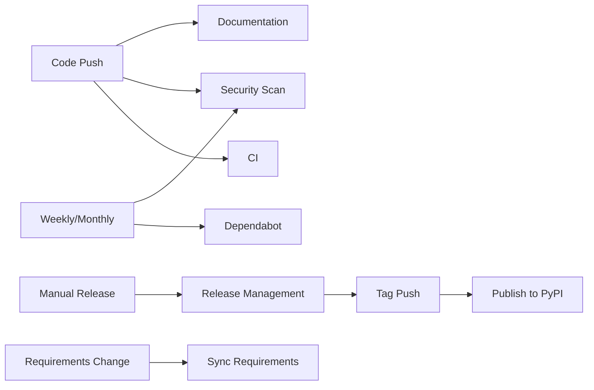

# GitHub Workflows Documentation

## Overview

This repository uses a comprehensive set of GitHub Actions workflows to ensure code quality, security, and automated deployment. All workflows have been designed with safety, security, and maintainability in mind.

## Active Workflows

### 1. CI (ci.yml) ✅ CRITICAL
**Purpose**: Core continuous integration for code quality and testing  
**Triggers**: All pushes and PRs to any branch  
**Matrix Testing**: Python 3.8-3.11 on Ubuntu, macOS, Windows (12 combinations)  
**Required for Merge**: Yes (branch protection enabled)

**Features**:
- Matrix testing across multiple Python versions and operating systems
- Dependency caching for faster builds
- Code linting with flake8
- Documentation linting with doc8
- Test execution with pytest and coverage reporting
- Circular import validation
- Coverage upload to Codecov (when token available)
- Coverage artifacts for review

**Success Criteria**: All matrix combinations must pass

### 2. Security Scan (security.yml) ⚠️ SECURITY
**Purpose**: Automated security vulnerability scanning  
**Triggers**: All pushes, PRs, and weekly schedule (Monday)  
**Tools**: Bandit, Safety, pip-audit  
**Required for Merge**: No (advisory only)

**Features**:
- Bandit security scan for Python code vulnerabilities
- Safety check for dependency vulnerabilities (CVE database)
- pip-audit for additional dependency security scanning
- Security report artifacts (90-day retention)
- Critical vulnerability detection with build failure
- JSON report generation for automated analysis

**Success Criteria**: No high-severity vulnerabilities detected

### 3. Documentation (docs.yml) 📚 REQUIRED
**Purpose**: Build and deploy documentation  
**Triggers**: All pushes and PRs  
**Deployment**: GitHub Pages (master branch only)  
**Required for Merge**: Yes (build must succeed)

**Features**:
- Documentation build testing on all branches
- Deployment to GitHub Pages from master
- Dependency caching for faster builds
- Link checking with sphinx-link-checker
- Documentation coverage reporting
- Artifact upload for built documentation
- Enhanced Sphinx options with warning detection

**Success Criteria**: Documentation builds without errors

### 4. Publish to PyPI (publish.yml) 🚀 TAG-BASED
**Purpose**: Automated PyPI package deployment  
**Triggers**: Version tags (v*) and manual dispatch  
**Security**: Tag-based only (no auto-publishing)  
**Ready for**: PYPI_API_TOKEN (available in ~2 weeks)

**Features**:
- Tag format verification (v*.*.* pattern)
- Full test suite execution before publishing
- Package verification with twine
- TestPyPI deployment for release candidates (RC tags)
- Production PyPI deployment for stable releases
- GitHub release creation with artifacts
- Dry-run option for testing
- Continue-on-error for missing tokens

**Success Criteria**: Tests pass, package validates, tag format correct

### 5. Branch Protection (branch-protection.yml) 🛡️ GOVERNANCE
**Purpose**: Configure branch protection rules  
**Triggers**: Manual only (workflow_dispatch)  
**Applies to**: master, main, develop branches  

**Protection Rules**:
- Requires CI success (Ubuntu 3.11 and 3.8)
- Requires documentation build success
- Requires security scan completion
- Requires 1 approving review
- Dismisses stale reviews automatically
- No force pushes allowed
- Optional admin enforcement

**Benefits**: Prevents untested code from reaching production

### 6. Sync Requirements (sync-requirements.yml) 🔄 MAINTENANCE
**Purpose**: Synchronize requirements across multiple files  
**Triggers**: Changes to requirements-dev.txt, pyproject.toml, monthly schedule  
**Safety**: Creates PRs instead of direct commits  

**Features**:
- Dynamic conda environment naming with timestamps
- File validation with dry-run checks
- Pull request creation for review
- Pip dependency caching
- Manual trigger with custom suffixes
- Automatic labeling and branch cleanup

**Success Criteria**: Generated files validate successfully

### 7. Dependabot (dependabot.yml) 🤖 AUTOMATION
**Purpose**: Automated dependency updates  
**Schedule**: Weekly (Python), Monthly (GitHub Actions)  
**Limits**: 5 open PRs maximum  

**Features**:
- Grouped updates for related packages
- Automatic labeling and conventional commits
- Separate handling for development and documentation dependencies
- Pull request limits to prevent spam

**Management**: Review and merge Dependabot PRs regularly

### 8. Performance Benchmark (benchmark.yml) ⚡ MONITORING
**Purpose**: Performance regression detection  
**Triggers**: master/main pushes, PRs, manual  
**Alert Threshold**: 150% (50% slowdown)  

**Features**:
- pytest-benchmark integration
- Memory profiling with memory_profiler
- Historical performance tracking
- Automated alerts on regressions
- Non-blocking alerts (continue-on-error)

**Success Criteria**: No significant performance regressions

### 9. Release Management (release-management.yml) 🏷️ RELEASES
**Purpose**: Automated release preparation  
**Triggers**: Manual only (workflow_dispatch)  
**Integration**: Triggers publish workflow via tags  

**Features**:
- Version type selection (major/minor/patch/prerelease)
- Automatic changelog generation from git history
- Release branch creation for staging
- Version file updates (when applicable)
- Git tag creation and pushing

**Process**: Manual → Release Branch → Tag → Auto-Publish

### 10. Update Workflow Documentation (update-workflow-doc.yml) 📝 UTILITY
**Purpose**: Maintain workflow documentation  
**Triggers**: PR events, workflow completions  
**Safety**: Skip CI directive to prevent loops  

**Features**:
- PR reference tracking (when script exists)
- Workflow status reporting
- Enhanced error handling with continue-on-error
- Automatic documentation updates

**Success Criteria**: Documentation stays current

## Required Repository Secrets

### Essential (for PyPI deployment - available in ~2 weeks)
- `PYPI_API_TOKEN`: Production PyPI uploads
- `TEST_PYPI_API_TOKEN`: Test PyPI uploads (recommended)

### Optional (for enhanced features)
- `CODECOV_TOKEN`: Coverage reporting integration
- `PERSONAL_ACCESS_TOKEN`: For workflows creating PRs (can use GITHUB_TOKEN)

## Workflow Dependencies



## Branch Protection Rules

When branch protection is enabled for master:

1. **Required Status Checks**:
   - CI (ubuntu-latest, 3.11)
   - CI (ubuntu-latest, 3.8)
   - Documentation / build
   - Security Scan / security

2. **Required Reviews**: 1 approving review
3. **Other Rules**: Dismiss stale reviews, no force pushes

## Success Metrics

### Daily Monitoring
- ✅ All CI builds passing across matrix
- ✅ No high-severity security vulnerabilities
- ✅ Documentation builds successfully
- ✅ No performance regressions detected

### Weekly Monitoring
- Review Dependabot PRs for dependency updates
- Check security scan results for new vulnerabilities
- Monitor performance benchmark trends

### Monthly Monitoring
- Review workflow effectiveness and performance
- Update documentation as needed
- Audit security reports and address issues

## Troubleshooting Guide

### Common Issues

#### CI Failures
1. **Matrix job failures**: Check specific OS/Python combination logs
2. **Dependency issues**: Clear cache, check requirements-dev.txt
3. **Test failures**: Run tests locally, check for platform-specific issues

#### Security Scan Failures
1. **High severity issues**: Review Bandit report, address vulnerabilities
2. **Dependency vulnerabilities**: Update affected packages via Dependabot
3. **False positives**: Configure Bandit to ignore specific issues

#### Documentation Build Failures
1. **Sphinx errors**: Check SPHINXOPTS configuration, fix warnings
2. **Missing dependencies**: Verify docs/requirements.txt is current
3. **Link check failures**: Fix broken links or add to ignore list

#### Publish Workflow Issues
1. **Tag format errors**: Ensure tags match v*.*.* pattern
2. **Missing tokens**: Configure PYPI_API_TOKEN when available
3. **Test failures**: Fix issues before tagging

### Recovery Procedures

#### Rollback Failed Release
```bash
# Remove problematic tag
git tag -d v1.0.0
git push origin :v1.0.0

# Create corrected tag
git tag v1.0.1
git push origin v1.0.1
```

#### Reset Branch Protection
Use the branch-protection.yml workflow with manual trigger to reconfigure rules.

#### Emergency Disable Workflow
Rename workflow file (add .disabled extension) and commit to temporarily disable.

## Performance Optimization

### Caching Strategy
- Pip dependencies cached by requirements file hash
- Documentation dependencies cached separately
- Cache keys include OS and Python version for matrix builds

### Build Time Optimization
- Parallel matrix execution with fail-fast: false
- Conditional steps based on specific criteria
- Artifact reuse between jobs where possible

### Resource Management
- Artifact retention policies (7-90 days based on importance)
- Continue-on-error for non-critical steps
- Timeout limits to prevent stuck workflows

## Maintenance Schedule

### Weekly Tasks
- Review Dependabot PRs and merge approved updates
- Check security scan results and address high-priority issues
- Monitor performance benchmarks for trends

### Monthly Tasks
- Review workflow run statistics and performance
- Update workflow documentation
- Audit security reports comprehensively
- Review and update dependency management strategy

### Quarterly Tasks
- Comprehensive workflow effectiveness review
- Update Python version matrix if needed
- Review and update security scanning tools
- Evaluate new GitHub Actions features

## Integration with Development Workflow

### Pull Request Process
1. Create feature branch
2. Push changes → triggers CI, Security, Docs workflows
3. Create PR → triggers same workflows plus additional validation
4. Address any workflow failures
5. Request review (required by branch protection)
6. Merge after approval and passing checks

### Release Process
1. Use Release Management workflow to prepare release
2. Review generated changelog and release branch
3. Merge release branch to master
4. Tag automatically triggers PyPI deployment
5. Monitor deployment success and GitHub release creation

### Hotfix Process
1. Create hotfix branch from master
2. Apply fix and test with CI workflow
3. Use Release Management for patch version
4. Deploy via standard tag-based process

This comprehensive workflow system ensures code quality, security, and reliable deployment while maintaining developer productivity and project maintainability.